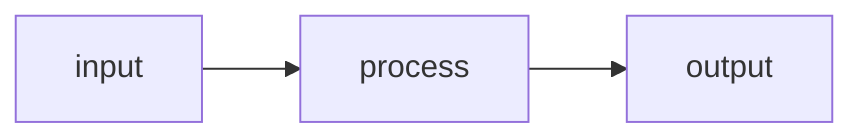
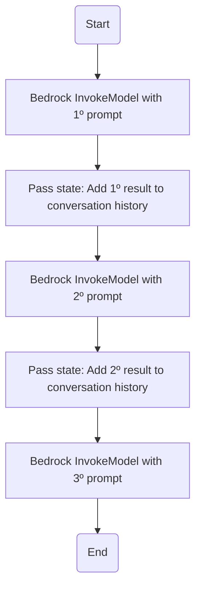

# Projeto: Assistente de Delivery utilizando AWS Step Functions e Amazon Bedrock.

## 📚 Descrição:
>***O repositório é um Lab. (laboratório) com intenção de aplicar conceitos dos serviços AWS (Amazon Web Service) como o Amazon Bedrock, Step Functions, entre outros no desenvolvimento de uma ferramenta focada nos pedidos para um delivery, ao qual proporciona automação e governança dos fluxos. Assim essa ferramenta passe por todos os processos. Porém de forma didática, ao não contemplar as práticas efetivas nessas ferramentas.***

## ✅ Tópicos de Construção:
- *Amazon Bedrock;*
- *Step Functions;* e
- *Fluxos de automação e governança.*

## 💻 Resumos: 
```
AWS + Automação + Governança
```

| **Temas** | **Resumos** |
|-------|---------|
| **Amazon Bedrock** | Plataforma de IA (Inteligência Artificial) da AWS. |
| **Step Functions** | Plataforma de workflows, ou seja, as máquinas de estado da AWS. |

## Framework da Ferramenta:

### Amazon Bedrock:

O Amazon Bedrock é um serviço totalmente gerenciado que fornece acesso seguro e de nível empresarial a modelos básicos de alto desempenho das principais empresas de IA, permitindo que você crie e escale aplicativos generativos de IA.

````
Obs.: De acordo com a própria doc. (documentação da AWS).
````

### Step Functions:

Com AWS Step Functions, você pode criar fluxos de trabalho, também chamados de Máquinas de estado, para criar aplicativos distribuídos, automatizar processos, orquestrar microsserviços e criar pipelines de dados e aprendizado de máquina.

````
Obs.: De acordo com a própria doc. (documentação da AWS).
````

### ASL:
---
A Amazon States Language é uma linguagem estruturada baseada em JSON que é usada para definir a máquina de estado, um conjunto de estados, que podem realizar trabalhos (estados Task), determinar para quais estados fazer transição (estados Choice), interromper uma execução com erro (estados Fail) e assim por diante.

````
Obs.: De acordo com a própria doc. (documentação da AWS).
````

- Como exemplo:
````
Arquivo em formato JSON com prompts de comando para os fluxos dos processos dentro desse software de delivery, ou seja, JSON encadeados dentro desse fluxo.
````

- JSON:
````
{
    "prompt_one": "ideias de comidas",
    "prompt_two": "ideias de bebidas",
    "prompt_tree": "ideias de locais"
}
````
---
### Workflow:


- Em Síntese:
````
  O start com o prompt das comidas entra, ele é processado por alguma LLM escolhida no Amazon Bedrock, retona um prompt de saída todos em formatdo de arquivo JSON. O que é feito para os prompts seguintes até o retorno final, ilustrada pelo diagrama.
````

## 📈🗂️🧑🏻‍💻 Atividades Relacionadas:
- Uso do Step Functions para automações e gerenciamento de atividades da aplicação;
- Uso do Amazon Bedrock para aplicações de LLMs (Large Linguage Models);
- Entendimento dos workflows;
- Entre outros.

## 🔍 Referências:
- [DIO - AWS - Agentes de IA em Campo]()
